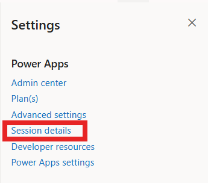
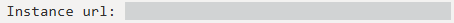

# Composant PCF Toastify Notifications

## Mise en place 
Installer les biblioteques
```bash
npm install
```
Installer PAC (Power Platform Tools) `Disponible dans les extensions visual studio`

Nettoyer la solution puis la push
```bash
npm run build
npm run clean
pac pcf push --publisher-prefix dev
```


Si l’environnement Power Platform n’est pas encore configuré :

```bash
pac auth login
pac auth list
pac auth create --environment <Link>
pac org who
```
Remplacer <Link> par l’URL de votre environnement Power Platform.
<Link> est trouvable dans les parametres de l'environnement PowerApps (A coté du nom de l'environnement) -> Session détails -> Instance url






## Objectif
Ce composant PCF affiche des notifications dans Power Apps en utilisant `react-toastify`. Il permet de déclencher des messages visuels personnalisés directement depuis des propriétés de l’application.

## Commandes principales
- `npm install` : installe les dépendances
- `npm run refreshTypes` : régénère les types PCF depuis le manifeste
- `npm run build` : construit le contrôle
- `npm run clean` : supprime les artefacts de build
- `pac pcf push --publisher-prefix dev` : déploie le composant dans Power Apps

## Présentation du contrôle
Le contrôle est conçu pour être ajouté comme contrôle virtuel dans Power Apps Canvas. Il ne présente pas de rendu direct dans le formulaire, mais il écoute des propriétés de notification et affiche un toast lorsque la valeur de trigger est mise à jour.

## Installation et initialisation
1. Importer le composant PCF dans votre solution Power Apps.
2. Ajouter le contrôle sur un écran ou un champ de type virtuel.
3. Lier les propriétés de notification aux champs ou formules Power Fx de votre application.
4. Mettre à jour `notificationTrigger` à chaque notification souhaitée.

## Guide d’utilisation
### 1. Paramétrer le contrôle dans Power Apps
Associer chaque propriété du contrôle à la valeur souhaitée dans l’éditeur de propriétés.

### 2. Déclencher une notification
Le composant déclenche une notification uniquement lorsque la valeur de `notificationTrigger` change.

- Utiliser une valeur différente pour chaque notification
- Exemple : timestamp, compteur, GUID, ou combinaison de valeurs dynamiques

### 3. Exemple de formule Power Fx
```PowerFx
Concatenate("toast-", Text(Now(), "yyyyMMddHHmmss"))
```

ou pour un bouton :
```PowerFx
Set(MyToastTrigger, "toast-" & Text(Now(), "yyyyMMddHHmmss"))
```

### 4. Lier le trigger
Dans les propriétés du contrôle, lier `notificationTrigger` à la variable `MyToastTrigger` ou à un champ Power Fx.

## Paramètres disponibles
### `notificationType`
- Valeurs : `success`, `info`, `warning`, `error`, `alert`
- Comportement : `alert` est traité comme `error`
- Valeur par défaut : `info`

### `notificationTitle`
- Titre en gras affiché avant le message
- Exemple : `Bravo !`, `Succès`, `Attention`
- Valeur par défaut : vide

### `notificationIcon`
- Emoji ou petit texte affiché à gauche du titre
- Exemple : `✅`, `⚠️`, `🔥`, `ℹ️`
- Valeur par défaut : vide

### `notificationMessage`
- Texte principal de la notification
- Exemple : `Sauvegarde effectuée avec succès.`
- Valeur par défaut : `Notification sans message`

### `notificationPosition`
- Positions supportées :
  - `top-right`
  - `top-left`
  - `bottom-right`
  - `bottom-left`
  - `top-center`
  - `bottom-center`
- Positions françaises acceptées :
  - `haut droite`
  - `haut gauche`
  - `bas droite`
  - `bas gauche`
  - `centre haut`
  - `centre bas`
- Valeur par défaut : `top-right`

### `notificationTheme`
- Valeurs : `colored`, `light`, `dark`
- Valeur par défaut : `colored`

### `notificationCloseOnClick`
- Valeurs : `true`, `false`
- Détermine si le toast se ferme au clic
- Valeur par défaut : `true`

### `notificationPauseOnHover`
- Valeurs : `true`, `false`
- Arrête le compte à rebours au survol
- Valeur par défaut : `true`

### `notificationHideProgressBar`
- Valeurs : `true`, `false`
- Cache la barre de progression si `true`
- Valeur par défaut : `false`

### `notificationActionUrl`
- URL ouverte lorsqu’on clique sur la notification
- Exemple : `https://example.com`
- Valeur par défaut : vide

### `notificationTrigger`
- Valeur unique qui déclenche la notification
- Doit changer à chaque notification souhaitée
- Exemple : `toast-20260609-120305`

### `notificationAutoClose`
- Durée en millisecondes avant fermeture automatique
- Exemple : `3000`, `4000`, `6000`
- Valeur par défaut : `5000`

## Configuration recommandée
### Option 1 : notification de succès
- `notificationType = "success"`
- `notificationTitle = "✅ Succès"`
- `notificationIcon = "✨"`
- `notificationMessage = "Sauvegarde effectuée avec succès."`
- `notificationPosition = "top-right"`
- `notificationTheme = "colored"`
- `notificationCloseOnClick = "true"`
- `notificationPauseOnHover = "true"`
- `notificationHideProgressBar = "false"`
- `notificationActionUrl = ""`
- `notificationTrigger = Concatenate("toast-", Text(Now(), "yyyyMMddHHmmss"))`
- `notificationAutoClose = 4000`

### Option 2 : alerte importante
- `notificationType = "warning"`
- `notificationTitle = "Attention"`
- `notificationIcon = "⚠️"`
- `notificationMessage = "Vérifiez les informations avant de continuer."`
- `notificationPosition = "top-center"`
- `notificationTheme = "dark"`
- `notificationCloseOnClick = "true"`
- `notificationPauseOnHover = "true"`
- `notificationHideProgressBar = "false"`
- `notificationActionUrl = "https://example.com/details"`
- `notificationTrigger = Concatenate("toast-", Text(Now(), "yyyyMMddHHmmss"))`
- `notificationAutoClose = 8000`

## Bonnes pratiques
- Mettre une valeur unique dans `notificationTrigger` à chaque notification
- Ne pas réutiliser la même valeur si l’on veut relancer la notification
- Préférer un message clair et court
- Utiliser `notificationIcon` et `notificationTitle` pour rendre l’alerte plus visible
- Utiliser `notificationActionUrl` uniquement pour des liens sûrs

## Notes importantes
- Si `notificationMessage` est vide, le composant affiche `Notification sans message`
- Si `notificationActionUrl` est renseigné, cliquer sur la notification ouvre le lien dans un nouvel onglet
- La notification ne s’affiche pas si `notificationTrigger` reste identique

## Dépannage rapide
- Si aucune notification n’apparaît, vérifier que `notificationTrigger` change bien
- Si le message est vide, vérifier `notificationMessage`
- Si la position n’est pas correcte, utiliser une valeur valide parmi la liste ci-dessus

